# Wallet Invitations via Organization Plugin Hooks

## Overview

Leverage Better Auth's existing infrastructure:

- **SIWE plugin** creates deterministic emails: `{walletAddress}@{domain}`
- **Organization plugin** hooks validate wallet ownership on invitation acceptance
- **OIDC provider** `getAdditionalUserInfoClaim` adds `groups` claim with org slugs

No custom routes required - just plugin configuration and hooks.

---

## Architecture Flow

```mermaid
flowchart TD
    subgraph invite [Admin Invites by Wallet]
        A[Admin calls invite-member] --> B[email = walletAddress + domain]
        B --> C[Store walletAddress in additionalFields]
        C --> D[sendInvitationEmail with invite link]
    end

    subgraph accept [User Accepts via SIWE]
        E[User signs in with SIWE] --> F[SIWE creates user with same deterministic email]
        F --> G[User calls accept-invitation]
        G --> H[Email check passes: invitation.email === user.email]
        H --> I[beforeAcceptInvitation hook verifies wallet matches]
        I --> J[User joins org with assigned role]
    end

    subgraph oidc [OIDC with Groups Claim]
        K[User requests OIDC auth] --> L[getAdditionalUserInfoClaim runs]
        L --> M[Fetch user org memberships]
        M --> N[Return groups claim with org slugs]
        N --> O[Downstream app uses groups for RBAC]
    end
```



---

## Key Insight: Deterministic Email Pattern

SIWE plugin (lines 311-314 of `/better-auth-fork/.../siwe/index.ts`):

```typescript
const domain = options.emailDomainName ?? getOrigin(ctx.context.baseURL);
const userEmail = `${walletAddress}@${domain}`;
```

For wallet invitations, we use the **same pattern**:

- Invite wallet `0xABC123...` → email becomes `0xABC123...@auth.example.com`
- User signs in with SIWE using `0xABC123...` → email is `0xABC123...@auth.example.com`
- Emails match → acceptance check passes

---

## Implementation

### 1. Organization Plugin Configuration

In [`src/lib/auth.ts`](src/lib/auth.ts):

```typescript
import { organization } from "better-auth/plugins";
import { APIError } from "better-auth/api";

// Helper to generate deterministic email from wallet
const getWalletEmail = (walletAddress: string) => {
  const domain = new URL(serverEnv.BETTER_AUTH_URL).host;
  return `${walletAddress.toLowerCase()}@${domain}`;
};

organization({
  schema: {
    invitation: {
      additionalFields: {
        // Store original wallet address for verification
        walletAddress: {
          type: "string",
          required: false,
          input: true,
        },
      },
    },
  },

  organizationHooks: {
    // Verify wallet ownership before accepting wallet-based invitations
    beforeAcceptInvitation: async ({ invitation, user, organization }) => {
      // Skip for email-only invitations
      if (!invitation.walletAddress) return;

      // Verify user has SIWE account with the invited wallet
      const accounts = await auth.api.listAccounts({ userId: user.id });
      const hasMatchingWallet = accounts.some(
        (a) =>
          a.providerId === "siwe" &&
          a.accountId.toLowerCase().startsWith(invitation.walletAddress.toLowerCase())
      );

      if (!hasMatchingWallet) {
        throw new APIError("FORBIDDEN", {
          message: "You must sign in with the invited wallet address to accept this invitation.",
        });
      }
    },
  },

  async sendInvitationEmail(data) {
    const inviteLink = `${serverEnv.BETTER_AUTH_URL}/invite/${data.id}`;
    
    if (data.walletAddress) {
      // Wallet invitation - could send via other channel or just log
      console.log(`[Wallet Invitation] Wallet: ${data.walletAddress}`);
      console.log(`[Wallet Invitation] Link: ${inviteLink}`);
    } else {
      // Email invitation - send via email service
      console.log(`[Email Invitation] To: ${data.email}`);
      console.log(`[Email Invitation] Link: ${inviteLink}`);
    }
  },

  invitationExpiresIn: 60 * 60 * 24 * 7, // 7 days
}),
```

### 2. Wallet Invitation Helper Function

Create a helper for admins to invite by wallet:

```typescript
// In auth-client or a server action
async function inviteByWallet(
  walletAddress: string,
  role: string,
  organizationId: string
) {
  const domain = new URL(import.meta.env.VITE_AUTH_URL).host;
  const email = `${walletAddress.toLowerCase()}@${domain}`;

  return authClient.organization.inviteMember({
    email,
    role,
    organizationId,
    walletAddress, // Stored in additionalFields for verification
  });
}
```

### 3. OIDC Groups Claim

In the `oidcProvider` configuration:

```typescript
oidcProvider({
  loginPage: "/login",
  consentPage: "/consent",
  scopes: ["openid", "profile", "email", "groups", "offline_access"],
  
  getAdditionalUserInfoClaim: async (user, scopes, client) => {
    const claims: Record<string, any> = {};

    if (scopes.includes("groups")) {
      // Fetch user's organization memberships
      const memberships = await auth.api.listOrganizations({
        query: { userId: user.id },
      });

      // Return org slugs as groups (ArgoCD/Dex format)
      claims.groups = memberships.map((m) => m.organization.slug);
    }

    return claims;
  },
}),
```

### 4. Disable Public Signups

```typescript
emailAndPassword: {
  enabled: true,
  disableSignUp: !serverEnv.ENABLE_REGISTRATION,
},

databaseHooks: {
  user: {
    create: {
      before: async (user, ctx) => {
        if (serverEnv.ENABLE_REGISTRATION) return;
        
        // Allow if this is an invitation acceptance flow
        // The org plugin sets invitation context
        if (ctx?.context?.invitation) return;

        throw new APIError("FORBIDDEN", {
          message: "Registration disabled. Contact admin for an invitation.",
        });
      },
    },
  },
},
```

### 5. Frontend: Simple Invite Acceptance Page

Create `src/routes/invite.$id.tsx` - a simple page that:

1. Fetches invitation details via `authClient.organization.getInvitation({ id })`
2. If wallet invitation: shows "Connect wallet to accept" button
3. If email invitation: shows login/signup prompt
4. On acceptance: calls `authClient.organization.acceptInvitation({ invitationId })`

This is just UI - all logic is handled by Better Auth's existing endpoints.

---

## Files to Modify/Create

| File | Changes |

|------|---------|

| [`src/lib/auth.ts`](src/lib/auth.ts) | Add `organization` plugin with wallet field, hooks, groups claim |

| [`src/lib/auth-client.ts`](src/lib/auth-client.ts) | Add `organizationClient` plugin |

| [`src/env.ts`](src/env.ts) | Ensure `ENABLE_REGISTRATION` is properly used |

| `src/routes/invite.$id.tsx` | Simple UI page for invitation acceptance |

| `src/lib/invite-helpers.ts` | Helper functions for wallet/email invitations |

---

## API Flow Summary

### Invite by Wallet

```
Admin → POST /organization/invite-member
        body: { email: "0xABC...@domain", role: "member", walletAddress: "0xABC..." }
```

### Accept Invitation

```
User → SIWE sign-in (creates user with email "0xABC...@domain")
User → POST /organization/accept-invitation
        body: { invitationId: "..." }
        → beforeAcceptInvitation hook verifies wallet
        → User added to org
```

### OIDC with Groups

```
App → GET /oauth2/authorize?scope=openid+groups
User → Consents
App → GET /oauth2/userinfo
      Response: { sub: "...", groups: ["org-slug-1", "org-slug-2"] }
```

---

## Security

1. **Wallet Verification**: `beforeAcceptInvitation` hook ensures SIWE account matches invited wallet
2. **Deterministic Emails**: Same pattern in SIWE plugin and invitation creation prevents spoofing
3. **Signup Disabled**: `databaseHooks` blocks all non-invitation signups
4. **Org Membership Required**: OIDC authorization checks for org membership before issuing tokens